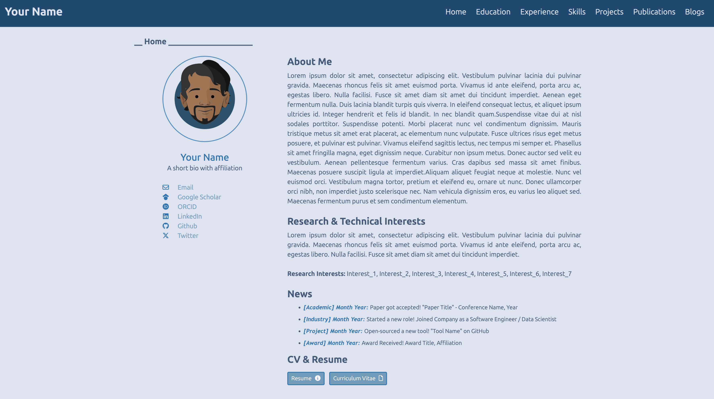
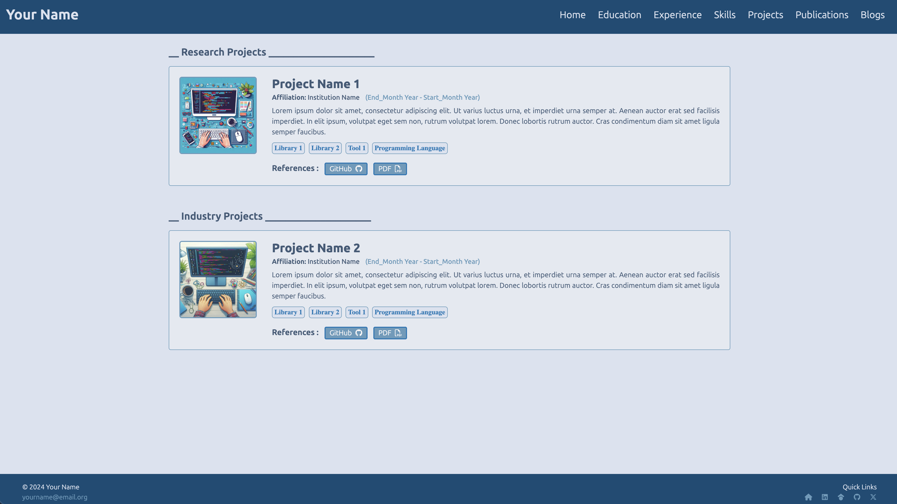
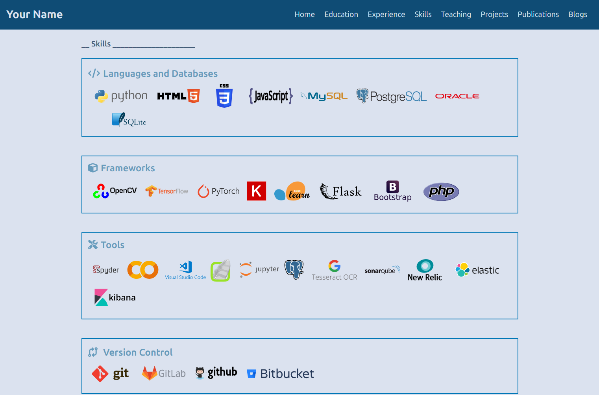
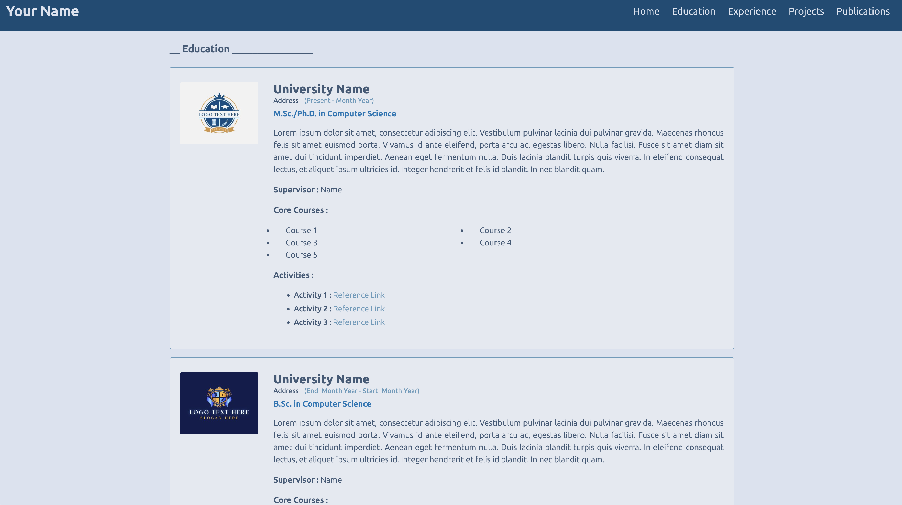
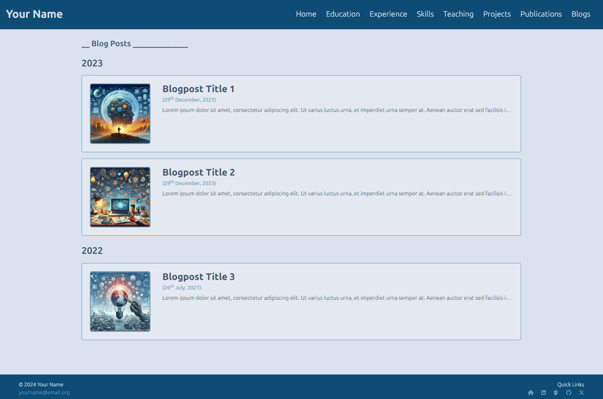
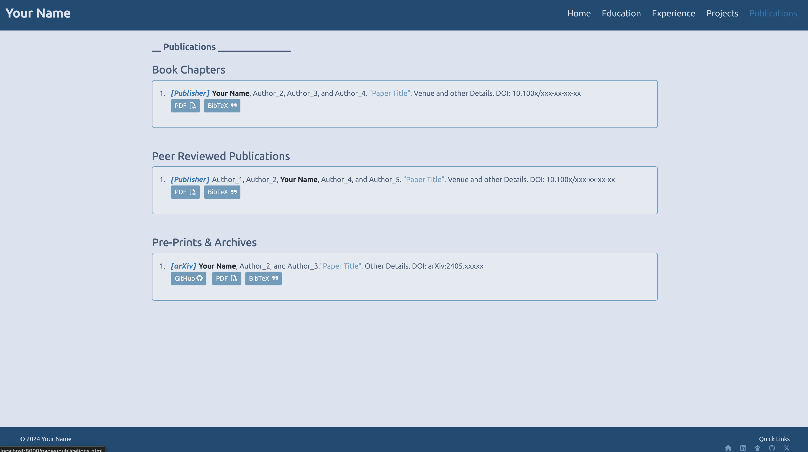

# Hybrid Academic & Industry Portfolio Template

This repository contains a premium, elegant, and highly structured **Hybrid Academic & Industry Portfolio Template** built using HTML, CSS, JavaScript, and Bootstrap. 

Unlike traditional purely academic portals, this template is meticulously designed for researchers, students, and professionals applying for both **Research Assistant (RA)** positions and **Industry (Software Engineering, Machine Learning, Data Science)** jobs. It achieves a perfect balance of research accomplishments and engineering scalability.

---

## Key Hybrid Features

- **Dual CV & Resume Setup**: High-level action buttons on the homepage for both an industry-focused **Resume** and an academic-focused **Curriculum Vitae (CV)**.
- **Categorized Experience**: A single cohesive `Experience` page with sub-sections for **Professional & Research Experiences** and **Teaching & Mentorship**, ensuring academic and corporate roles do not clutter your menu.
- **Split Project Layout**: The `Projects` page is cleanly organized into two distinct sections: **Research Projects** (focusing on methodology, literature, models) and **Industry Projects** (focusing on code execution, architecture, and impact).
- **Modern Tech Skills & Research Competencies**: A redesigned `Skills` page grouping languages, deep learning frameworks, dev tools/infra (Docker, AWS, Git), and research/writing tools (LaTeX, Jupyter) side-by-side.
- **Academic Publication Port**: An elegant publications tracker, crucial for RA roles and standard R&D research positions, with seamless formatting.
- **Clean Profile Sidebar**: An ultra-clean left sidebar focusing on key high-signal links (Email, LinkedIn, GitHub, Scholar, ORCID, Twitter).

---

## Sections Included

- **Home**: Welcome introduction, news feeds (highlighting research and industry highlights alike), and dual CV & Resume buttons.
- **Education**: Detailed layout of academic qualifications, courses, and GPAs.
- **Experience**: Detailed professional work history, academic/GRA/GTA roles, and teaching assistantships.
- **Skills**: Balanced list of coding languages, ML frameworks, developer tools, and academic tools.
- **Projects**: Cohesive dual-section layout for Research Projects and Industry/Open-Source Projects.
- **Publications**: Seamless publication tracking for academic citations and research papers.
- **Blogs**: Space to write technical reviews and academic discussions.


## Screenshots
> ### Homepage
>  

> ### Projects
>  

> ### Skills, Education
> <span style="margin-left:15px"> 

> ### Blogposts, Publications
> <span style="margin-left:15px"> 

---

## Getting Started

1. **Clone the Repository**
   ```bash
   git clone https://github.com/Sarvesh-369/portfolio-template.github.io.git
   ```

2. **Navigate to the Project Directory**
   ```bash
   cd portfolio-template.github.io
   ```

3. **Open `index.html` in Your Browser**
   - Simply open the `index.html` file in your preferred web browser to see your hybrid portfolio.

---

## Customization

To customize the portfolio, edit the HTML files in the `pages` directory and the CSS files in `assets/css`. 

- Place your actual Resume PDF in `assets/resume.pdf` and your CV PDF in `assets/cv.pdf` to activate the download buttons.
- Modify paths, social handles, and academic links directly in the HTML template structures.
