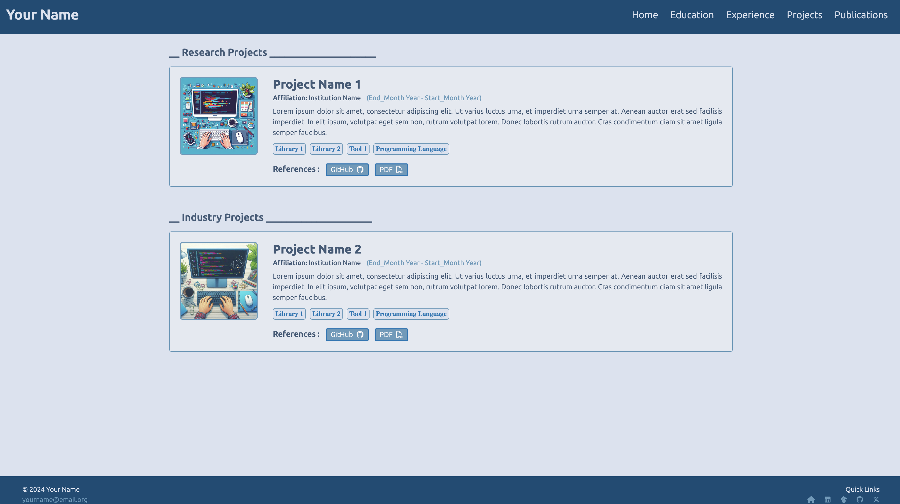

# Hybrid Academic & Industry Portfolio Template

This repository contains a premium, elegant, and highly structured **Hybrid Academic & Industry Portfolio Template** built using HTML, CSS, JavaScript, and Bootstrap. 

Unlike traditional purely academic portals, this template is meticulously designed for researchers, students, and professionals applying for both **Research Assistant (RA)** positions and **Industry (Software Engineering, Machine Learning, Data Science)** jobs. It achieves a perfect balance of research accomplishments and engineering scalability.

---

## Key Hybrid Features

- **Dual CV & Resume Setup**: High-level action buttons on the homepage for both an industry-focused **Resume** and an academic-focused **Curriculum Vitae (CV)**.
- **Categorized Experience**: A single cohesive `Experience` page with sub-sections for **Professional & Research Experiences** and **Teaching & Mentorship**, ensuring academic and corporate roles do not clutter your menu.
- **Split Project Layout**: The `Projects` page is cleanly organized into two distinct sections: **Research Projects** (focusing on methodology, literature, models) and **Industry Projects** (focusing on code execution, architecture, and impact).

- **Academic Publication Port**: An elegant publications tracker, crucial for RA roles and standard R&D research positions, with seamless formatting.
- **Clean Profile Sidebar**: An ultra-clean left sidebar focusing on key high-signal links (Email, LinkedIn, GitHub, Scholar, ORCID, Twitter).

---

## Sections Included

- **Home**: Welcome introduction, news feeds (highlighting research and industry highlights alike), and dual CV & Resume buttons.
- **Education**: Detailed layout of academic qualifications, courses, and GPAs.
- **Experience**: Detailed professional work history, academic/GRA/GTA roles, and teaching assistantships.

- **Projects**: Cohesive dual-section layout for Research Projects and Industry/Open-Source Projects.
- **Publications**: Seamless publication tracking for academic citations and research papers.


## Screenshots
> ### Homepage
>  

> ### Projects
>  

> ### Education
>  

> ### Publications
>  

---

## Getting Started

1. **Clone the Repository**
   ```bash
   git clone https://github.com/Sarvesh-369/portfolio-template.github.io.git
   ```

2. **Navigate to the Project Directory**
   ```bash
   cd portfolio-template.github.io
   ```

3. **Open `index.html` in Your Browser**
   - Simply open the `index.html` file in your preferred web browser to see your hybrid portfolio.

---

## Customization

To customize the portfolio, edit the HTML files in the `pages` directory and the CSS files in `assets/css`.

### Document Storage & Management Guide

A dedicated, organized document structure is located inside `assets/documents/`. Save all your PDF files using the following paths to keep the repository clean and maintainable:

| Document Type | Local Folder / File Name | HTML Link Path |
| :--- | :--- | :--- |
| **Industry Resume** | `assets/documents/resume.pdf` | Already linked on **Home** (`./assets/documents/resume.pdf`) |
| **Academic CV** | `assets/documents/cv.pdf` | Already linked on **Home** (`./assets/documents/cv.pdf`) |
| **Research Papers / Preprints** | `assets/documents/publications/paper_name.pdf` | Link from **Publications** (`../assets/documents/publications/paper_name.pdf`) |
| **Project Reports / Slides** | `assets/documents/projects/project_name.pdf` | Link from **Projects** (`../assets/documents/projects/project_name.pdf`) |


---

### How to Link Your Documents in HTML:

#### 1. Linking a Research Paper PDF in `pages/publications.html`
1. Save your research paper PDF as `assets/documents/publications/my_paper.pdf`.
2. Open `pages/publications.html` in your editor, locate the relevant publication, find the **PDF** button, and update the link `href` like this:
   ```html
   <button type="button" class="btn btn-blue btn-sm">
       <a href="../assets/documents/publications/my_paper.pdf" target="_blank">
           PDF <i class="ml-1 fa-regular fa-file-pdf"></i>
       </a>
   </button>
   ```

#### 2. Linking a Project Report/Slides PDF in `pages/projects.html`
1. Save your project writeup/report PDF as `assets/documents/projects/my_project.pdf`.
2. Open `pages/projects.html` in your editor, locate the relevant project, find the **PDF** button, and update the link `href` like this:
   ```html
   <button type="button" class="ml-2 btn btn-blue btn-sm py-0">
       <a href="../assets/documents/projects/my_project.pdf" target="_blank">
           PDF <i class="ml-1 fa-regular fa-file-pdf"></i>
       </a>
   </button>
   ```

